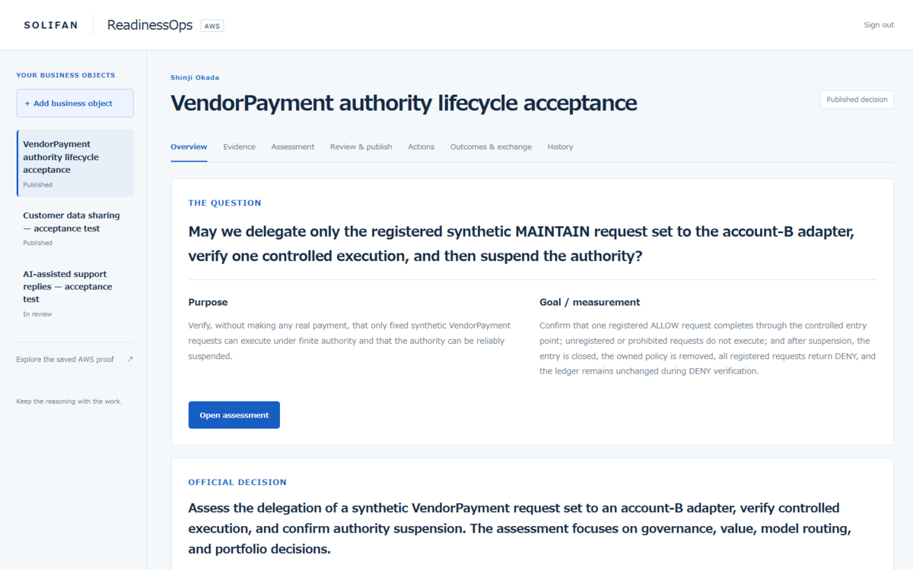
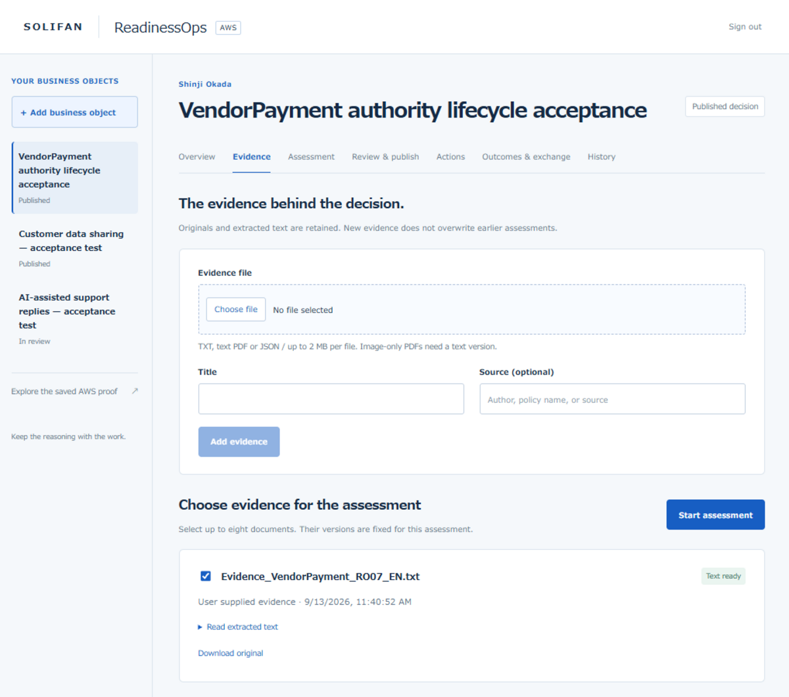
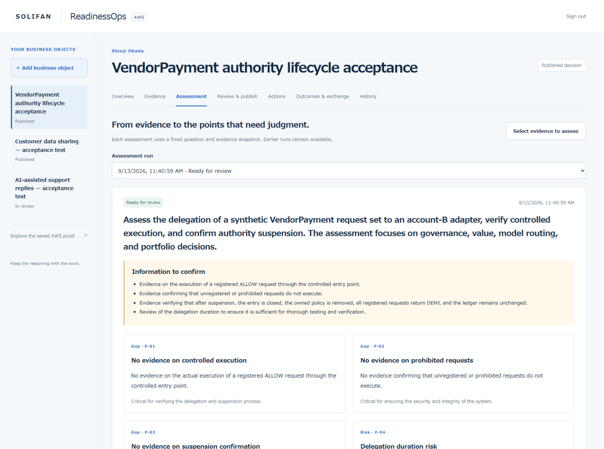
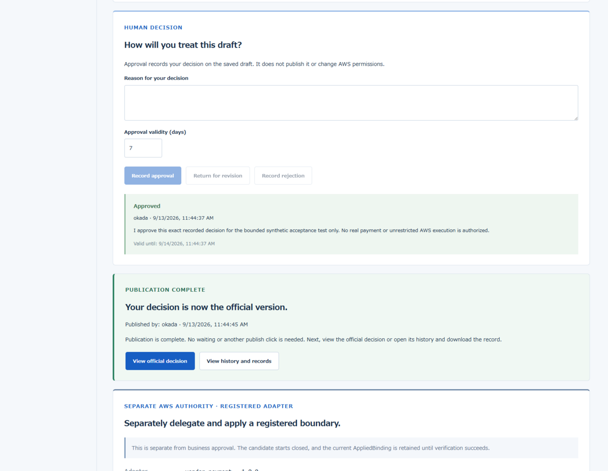
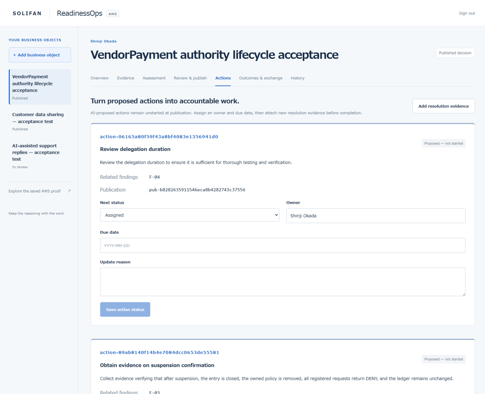
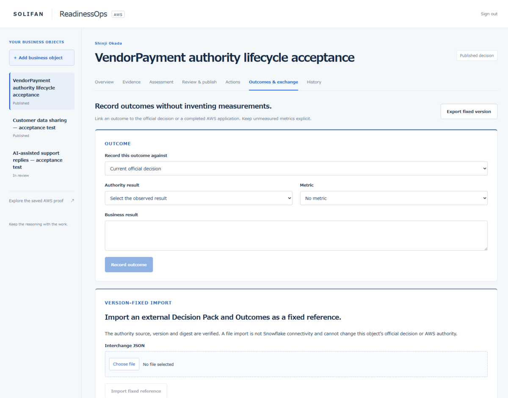
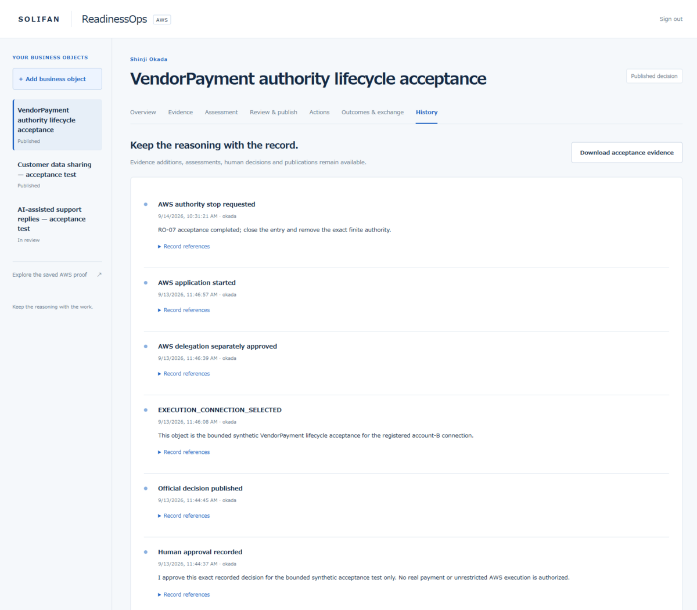
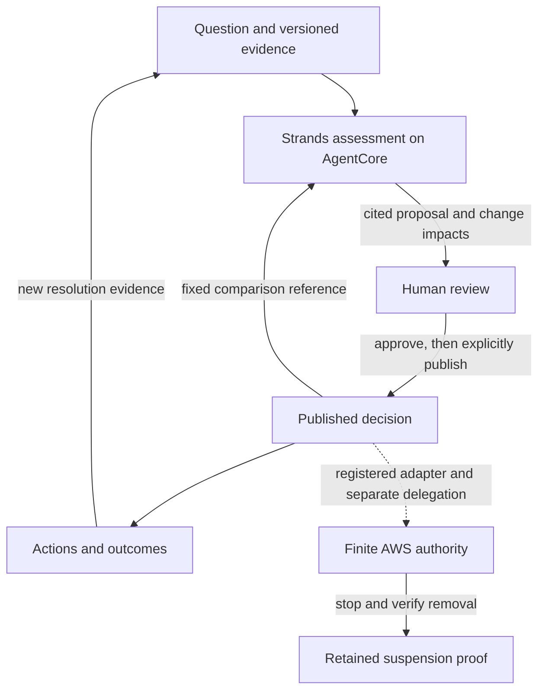

# ReadinessOps · Authority Delta

**Let AI prepare the evidence. Keep people in control of the decision—and the authority to act.**

ReadinessOps helps operations leads and AI program owners review changing evidence,
decide what needs attention, and follow work through to completion. A Strands agent
prepares cited assessments and compares them with the published decision. People
review the changes, assign actions and decide what becomes official.

[Open the live workspace](https://d3rn3hqm0ax5ux.cloudfront.net/) ·
[Three-minute judge guide](submission/JUDGE_GUIDE.md) ·
[Developer briefing](docs/ReadinessOps_Authority_Delta_Developer_Briefing.pdf) ·
[Architecture](docs/ARCHITECTURE.md) ·
[Verified results](#verified-on-aws) ·
[Build and verify](docs/DEVELOPMENT.md)

Built by **SOLIFAN** for [Agents for Humans](https://agentsforhumans.devpost.com/),
Professional Agents track. **Strands Agents SDK · Amazon Bedrock AgentCore · Amazon Nova Pro · Apache-2.0**

## The work it takes off a person's desk

When evidence changes, an operations lead has to reread documents, reconstruct
the earlier decision, identify unresolved issues and prepare the next review.
The reasoning often lives apart from the action list and the evidence of completion.

ReadinessOps brings that work into one record. After a person selects the evidence
and starts an assessment, the agent reads the fixed inputs, prepares findings and
next actions, and compares four decision perspectives: **Governance, Value,
Model routing and Portfolio**. Processing runs in the background; the resulting
proposal is available for human review.

The intended benefit is less repeated review preparation and a clearer basis for
decisions. The demonstrated results below establish the workflow and technical
controls; commercial savings and productivity gains have not been measured.

## What makes Authority Delta useful

| Question people need answered | What the product does |
| --- | --- |
| What changed since we approved this? | Compares a new assessment with the exact published decision, preserving item identities and distinguishing affected, unchanged and unknown impacts. |
| Did completing the action resolve the issue? | Requires new resolution evidence at completion and carries it into a subsequent assessment. Earlier evidence and failed runs remain in history. |
| What may the agent actually do? | Keeps AI proposals, human approval, publication and AWS delegation separate. A connected adapter receives only separately approved, finite authority. |
| Has its authority really stopped? | Closes the entry first, then verifies removal of the owned Policy and live DENY results for every registered request. |

The core workflow works without an execution adapter. The optional AWS connector
adds enforceable authority to that workflow.

## Verified on AWS

These are observed acceptance scenarios in the deployed product, with retained
records and explicit limits.

| Demonstrated result | Evidence |
| --- | --- |
| **Evidence changed the proposed decision.** A completed action supplied new suspension evidence. Reassessment became ready for human review; Governance and Portfolio were affected, while Value and Model routing remained unknown. The official decision stayed unchanged. | [Action and reassessment · RO-08](docs/RO08_LIVE_ACCEPTANCE.md) |
| **Authority was applied, used and removed.** One registered request completed with ALLOW. After suspension, the entry was closed, the owned Policy absent, and all seven registered requests returned DENY with an unchanged ledger. | [Authority lifecycle · RO-07](docs/RO07_LIVE_ACCEPTANCE.md) |
| **Outcomes preserved the difference between proof and benefit.** Two outcome records retained an observed technical result and an explicitly unmeasured commercial result. | [Outcomes · RO-10](docs/BUSINESS_OUTCOME_INTERCHANGE.md#scope-and-remaining-acceptance) |
| **Import preserved the official record.** A synthetic external reference was imported and reimported without duplication or changes to the official decision or authority. | [Fixed-reference exchange · RO-11](docs/BUSINESS_OUTCOME_INTERCHANGE.md#scope-and-remaining-acceptance) |

The execution example uses **synthetic VendorPayment requests; no real payment**.
Its authority is currently **Suspension confirmed**. The later assessment is a
candidate for review, not renewed permission to execute. See the
[judge guide](submission/JUDGE_GUIDE.md) to inspect this state without rerunning it.

## Explore the complete workspace

These supplied captures show the deployed workspace across all seven views.
They preserve the business-object list and workflow navigation. They are retained
captures; the latest reassessment is documented in the live results above.

Select a preview to open the complete capture at its original resolution.

| 1. Versioned evidence | 2. Cited agent assessment |
| --- | --- |
| Originals and extracted text are retained; a new version never rewrites the evidence used by an earlier assessment. | A Strands agent returns gaps, risks and next actions tied to the fixed evidence snapshot. |
|  |  |

| 3. Human review and publication | 4. Accountable actions |
| --- | --- |
| A signed-in reviewer edits the proposal and records judgment without publishing or changing AWS permissions. Publication and AWS delegation remain separate explicit actions. | Published actions receive an owner, due date, status and new resolution evidence before completion. |
|  |  |

| 5. Outcomes and exchange | 6. Retained history |
| --- | --- |
| Outcomes attach to the official decision or completed AWS application; unmeasured metrics remain explicit and external packs are immutable references. | Evidence, assessments, human decisions, publications and AWS lifecycle events remain downloadable and reviewable. |
|  |  |

## How the agent and the human work together

| AWS component | Its job |
| --- | --- |
| Strands Agents SDK + Amazon Nova Pro | Read selected evidence and generate cited, validated assessment proposals. Reassessment is generated in sections with a bounded call budget. |
| Amazon Bedrock AgentCore Runtime | Host the assessment agent and the registered execution runtime. |
| AgentCore Gateway and Policy | Enforce the connected adapter's exact permitted tool/request boundary. |
| Cognito, API Gateway and Lambda | Authenticate people and enforce business commands and separate authority transitions. |
| DynamoDB, versioned S3 and SQS | Retain evidence and decisions, queue work, and recover interrupted operations. |
| CloudFront + React/TypeScript | Present the complete reviewer workspace. |

[Detailed architecture](docs/ARCHITECTURE.md) · [Service and code boundaries](docs/IMPLEMENTATION.md)

## Developer briefing

- [ReadinessOps Authority Delta Developer Briefing (PDF)](docs/ReadinessOps_Authority_Delta_Developer_Briefing.pdf)

This 15-page briefing starts with the people Authority Delta helps and the work
it takes off their desks. It then explains the business record, Authority Delta
comparison, human decision boundaries, AWS service responsibilities, optional
execution connector, verified suspension rule, extension points and observed
acceptance scope.

## Scope you can rely on

- Assessments are proposals. Reviewers must check the reasoning and the relevance
  of citations; exact quotation matching alone cannot prove an interpretation.
- Approval, publication and AWS delegation are separate operations. New evidence
  does not silently change a published decision or grant execution permission.
- The core product needs no second AWS account. The supplied **VendorPayment
  connector** uses a distinct target account; that is the connected topology
  supported and verified in this release.
- External Decision Pack import is a fixed file reference. It does not establish
  live Snowflake connectivity or overwrite the AWS workspace's official record.

## Inspect, verify or build

| Your goal | Start here |
| --- | --- |
| Review the working product | [Judge guide](submission/JUDGE_GUIDE.md); sign-in credentials belong in the private submission instructions |
| Understand the intended users, workflow and implementation boundaries | [Developer briefing](docs/ReadinessOps_Authority_Delta_Developer_Briefing.pdf) |
| Check the retained AWS proof | [Offline verification](submission/JUDGE_GUIDE.md#verify-the-downloaded-evidence) |
| Run local checks or inspect deployment instructions | [Development guide](docs/DEVELOPMENT.md) |
| Explore contracts and evidence | [Documentation map](docs/README.md) |

[Apache-2.0 license](LICENSE). Prior ReadinessOps projects informed the design;
no prior application source has been incorporated into this repository.
