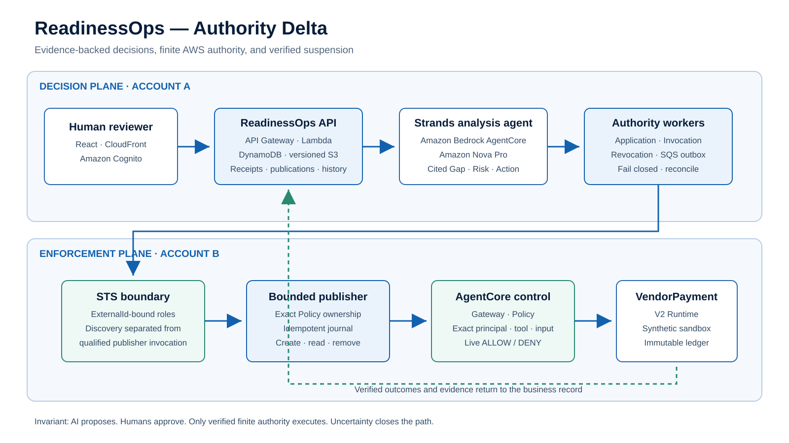

# ReadinessOps — AWS edition

**Evidence → cited agent proposal → human decision → finite AWS authority → verified removal.**

[Live product](https://d3rn3hqm0ax5ux.cloudfront.net/) ·
[Judge guide](submission/JUDGE_GUIDE.md) ·
[Architecture](docs/ARCHITECTURE.svg) ·
[RO-07 live acceptance](docs/RO07_LIVE_ACCEPTANCE.md) ·
[Implementation](docs/IMPLEMENTATION.md) ·
[Acceptance contract](docs/ACCEPTANCE_READINESSOPS_v1.2.md)



ReadinessOps connects business and AI initiatives with evidence, gaps, risks,
actions, human decisions, publication and operational history. **Authority Delta**
is its reassessment feature: when an agent release changes, check whether earlier
human judgments still hold and return the affected decisions for review.
**VendorPayment** is the first synthetic business adapter used to demonstrate this
flow. It does not define the product's business scope.

Created for the AWS Agents for Humans Hackathon, Professional Agents track.
Apache-2.0. Prior ReadinessOps projects informed the design; no prior application
source has been incorporated into this repository.

## Why it matters

An AI proposal, a human approval, a published business decision and active runtime
permission are different facts. ReadinessOps keeps them separate and joins them
with evidence. The Strands agent can propose; only an authenticated human can
approve and publish; only a verified, finite adapter binding can execute.

When authority is stopped, the product closes its entry first and does not report
completion until the exactly owned Policy is absent and every registered request
returns a live DENY result.

## Live result — 2026-09-14

The two-account VendorPayment acceptance completed in `ap-northeast-1`:

- authenticated business decision and separate AWS delegation;
- application verified against the registered account-B Runtime and Policy engine;
- one normal registered request completed with `ALLOW`;
- the product entry closed before revocation;
- the exactly owned Policy was removed;
- every registered request returned live `DENY` with unchanged-ledger evidence;
- the authenticated export passed `RO07_LIVE_AUTHORITY_LIFECYCLE_CONFIRMED`.

See [the live acceptance record](docs/RO07_LIVE_ACCEPTANCE.md). The check is
offline and performs no AWS action.

## Product workflow

1. Register a business question, owner, goals and versioned evidence.
2. Run a Strands agent that returns cited Gap, Risk, Action and Decision proposals.
3. Let an authenticated person edit, approve and explicitly publish one revision.
4. When a registered adapter exists, approve a separate finite delegation.
5. Apply only after live canary verification; record controlled outcomes.
6. Reassess affected decisions when evidence or an agent release changes.
7. Close the entry, remove exact authority, prove DENY and retain the history.

## Evidence-backed state

The local business workflow now includes publication-bound operational Actions
and version-fixed Outcome/Metric interchange. Measured metrics require value,
unit, period, source and observed/estimated basis; unmeasured metrics cannot carry
a zero or implied result. External imports are immutable references and cannot
replace the AWS workspace's official decision or AppliedBinding. See
`docs/BUSINESS_ACTION_LIFECYCLE.md` and
`docs/BUSINESS_OUTCOME_INTERCHANGE.md`. Live RO-08/10/11 acceptance remains
`NOT_RUN`.

| Area | Evidence-backed state |
| --- | --- |
| AWS baseline and fixed Runtime authorization | Gate 0 and Gate A PASS from operator-returned AWS evidence |
| Strands semantic analysis | SEM-01/02 PASS; changed case P-002, benign comparison unchanged |
| Authenticated workspace | Earlier Workbench sign-in and screen access confirmed by user |
| Shared ReadinessOps workspace | Deployed object, evidence, cited assessment, human review, publication, Actions and history workflow |
| Business contracts | Registered/versioned adapter binding; independent data-sharing contract tested locally; only VendorPayment has live AWS proof |
| Human decisions / publication | Authenticated reviewer approval and explicit publication observed in the live workspace |
| Customer connector | Distinct account-B foundation/connector and verified account-A wiring deployed |
| Live authority lifecycle | Registered ALLOW execution, entry closure, exact Policy removal, all-request DENY and unchanged-ledger export: PASS |
| Submission readiness | Public repository, public video and Devpost publication are external release steps |

The product target is [AD-BASELINE-1.2](docs/PRODUCT_BASELINE_v1.2.md).
Historical AD-BASELINE-1.0 contracts and AWS proofs remain unchanged. No local
calculation, view or test is claimed as a live Gateway authorization result.

## Existing environment update

The prepared `ReadinessOps_AWS_Workspace_Update.py` updates the existing workspace
at its current URL using the already saved, version-pinned Gate B evidence.
It checks the confirmed reviewer and retains the password. The source and resume
record are kept under `~/readinessops-work/` in CloudShell, not `/tmp`.
See [workspace update](docs/READINESSOPS_WORKSPACE_UPDATE.md) for exact scope and
recovery. Do not rerun bootstrap, Gate A or Gate B to update the workspace.

## Local verification

The fixed Python 3.12 environment uses the committed deployment and analysis
lockfiles and vendor wheels. With `.venv-analysis` prepared:

```bash
PYTHONPATH=src:scripts:tests:. .venv-analysis/bin/python -m unittest discover -s tests -q
npm run build --prefix workbench
```

`workbench/test.mjs` consumes the locally generated review fixture from
`tests/test_workbench.py`. It tests rendered sections and the PKCE contract; it
is not browser or live AWS acceptance. Delivery validation runs the actual
operator file from an isolated directory through a local AWS CLI double.

## Code boundaries

- `src/authority_delta/readiness.py`: shared evidence/findings/actions/history.
- `adapter_contract.py`, `decisions.py`, `cedar.py`: common validated boundary
  identities, decisions and exact principal/tool/input scope rendering.
- `adapters/vendor_payment*.py`: sample business evaluation, boundary, policy and
  presentation. Historical `domain.py` / `policy_plan.py` imports are compatibility shims.
- `packages/contracts/readinessops.schema.json`: shared read-only workspace and
  boundary envelope v1.1; legacy `authority-delta.schema.json` is retained unchanged.
- `workbench/`, `services/workbench/`: authenticated UI and version-pinned read API.
- `infra/`, `services/`, `scripts/`: AWS resources, runtimes and delivery.
- `evidence/`, `status/`: observed results, exact scope and implementation handoff.

The general workflow, reassessment contract and bounded VendorPayment application
path are implemented. Published action proposals remain unstarted until
an authenticated user assigns an owner and due date; completion requires new,
versioned resolution evidence and links to the next reassessment. See
`docs/BUSINESS_ACTION_LIFECYCLE.md`.

A distinct account B is connected through separate ExternalId-bound discovery and
publisher roles. Account A independently rereads the registered resources through
the read-only DiscoveryRole before deploying its observed binding. The connected
readiness gate rejects mixed versions/accounts and premature authority claims
without exposing the ExternalId. The live lifecycle result is documented in
`docs/RO07_LIVE_ACCEPTANCE.md`.
