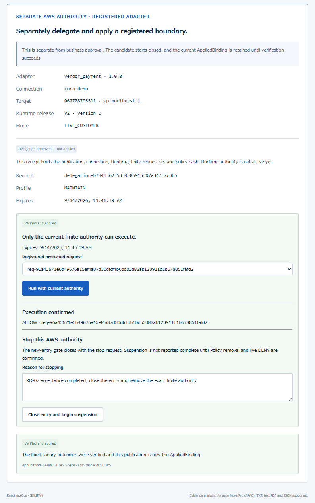
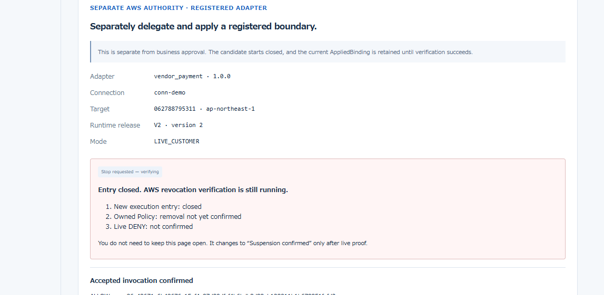
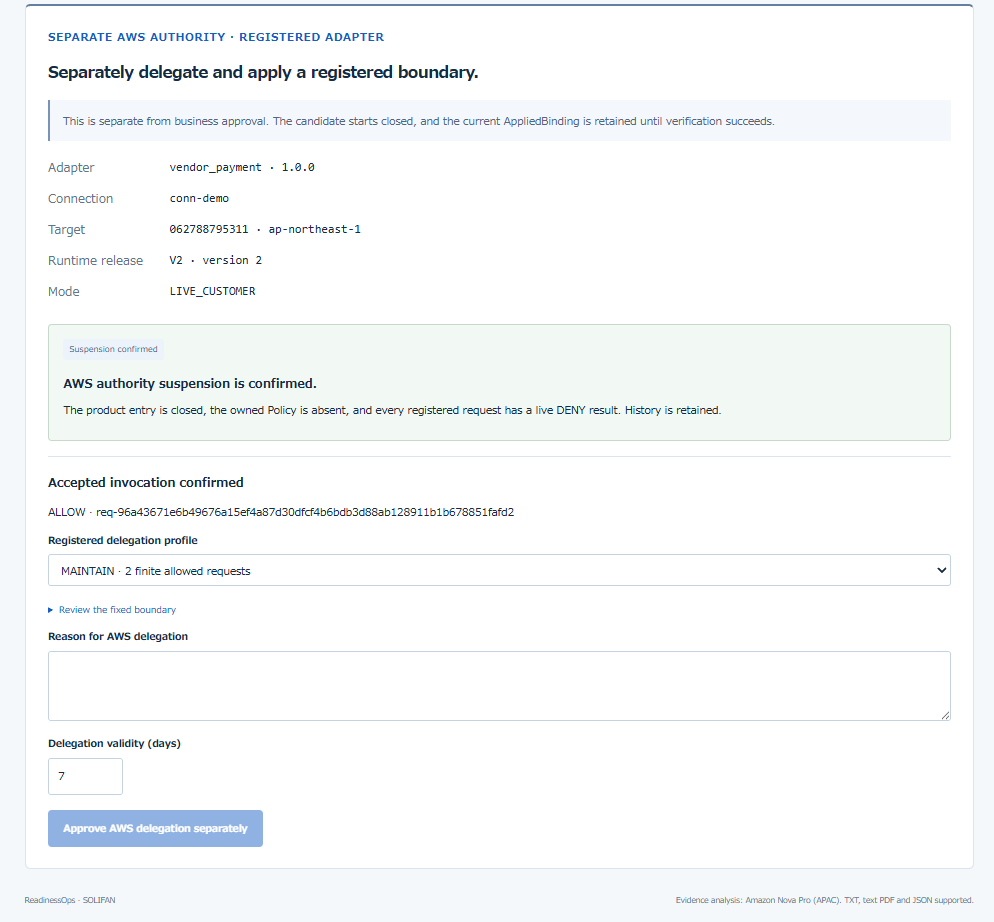
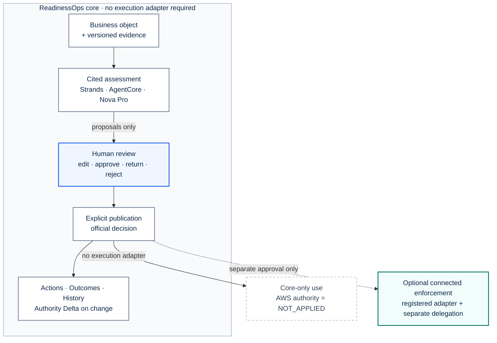

# ReadinessOps — AWS edition

**The accountable path from evidence to human decision—and, when connected, finite AWS authority with verifiable removal.**

[Live product](https://d3rn3hqm0ax5ux.cloudfront.net/) ·
[Judge guide](submission/JUDGE_GUIDE.md) ·
[Architecture](docs/ARCHITECTURE.md) ·
[RO-07 live acceptance](docs/RO07_LIVE_ACCEPTANCE.md) ·
[Implementation](docs/IMPLEMENTATION.md) ·
[Documentation map](docs/README.md) ·
[Acceptance evidence contract](docs/INTEGRATED_ACCEPTANCE_EVIDENCE.md)

[](docs/product-screens/journey/00-overview.png)

ReadinessOps is a shared operating record for consequential AI work. It keeps the
business question, versioned evidence, cited agent analysis, human judgment,
publication, accountable follow-up, measured outcomes and operational history in
one place. **Authority Delta** identifies which official decisions are affected
when evidence, rules or an Agent release changes. When a registered execution
adapter exists, a separate connected-enforcement path can also turn an approved
boundary into narrowly bounded, time-limited AWS authority and prove its removal.

**VendorPayment is a synthetic acceptance adapter, not the product boundary.** The
same workflow supports other business objects, evidence sets and registered
adapters without giving an agent open-ended AWS access.

Created for the AWS Agents for Humans Hackathon, Professional Agents track.
Apache-2.0. Prior ReadinessOps projects informed the design; no prior application
source has been incorporated into this repository.

## Why it matters

An AI proposal, a human approval, a published business decision and active runtime
permission are different facts. ReadinessOps keeps them separate and joins them
with evidence. The Strands agent can propose; only an authenticated human can
approve and publish. The core product remains useful without an execution adapter;
only a separately approved, verified and finite adapter binding can execute.

When authority is stopped, the product closes its entry first and does not report
completion until the exactly owned Policy is absent and every registered request
returns a live DENY result.

## The complete product journey

These are live screens from one completed VendorPayment acceptance—not mockups.
Each screen preserves the full workspace context: the business-object portfolio,
the seven-stage workflow and the current published state.

The previews keep the README readable. Select any image to inspect the complete,
cursor-free capture at its original resolution.

| 1. Versioned evidence | 2. Cited agent assessment |
| --- | --- |
| Originals and extracted text are retained; a new version never rewrites the evidence used by an earlier assessment. | A Strands agent returns gaps, risks and next actions tied to the fixed evidence snapshot. |
| [](docs/product-screens/journey/01-versioned-evidence.png) | [](docs/product-screens/journey/02-cited-agent-assessment.png) |

| 3. Human review and publication | 4. Accountable actions |
| --- | --- |
| A signed-in reviewer edits the proposal and records judgment without publishing or changing AWS permissions. Publication and AWS delegation remain separate explicit actions. | Published actions receive an owner, due date, status and new resolution evidence before completion. |
| [](docs/product-screens/journey/03-human-review-and-publication.png) | [](docs/product-screens/journey/04-accountable-actions.png) |

| 5. Outcomes and exchange | 6. Retained history |
| --- | --- |
| Outcomes attach to the official decision or completed AWS application; unmeasured metrics remain explicit and external packs are immutable references. | Evidence, assessments, human decisions, publications and AWS lifecycle events remain downloadable and reviewable. |
| [](docs/product-screens/journey/05-outcomes-and-exchange.png) | [](docs/product-screens/journey/06-retained-history.png) |

## Authority Delta — change review and optional AWS enforcement

Authority Delta compares new evidence, conditions or Agent releases with the
official decision and identifies affected, unchanged and unknown items. This
change review does not require an AWS execution account.

When a registered adapter is connected, business approval still does not silently
become runtime permission. An authenticated person separately approves a boundary
containing the publication, connection, Runtime release, finite request set,
Policy hash and expiry. The entry starts closed, opens only after verification,
and closes before revocation begins.

| Registered execution | Revocation in progress | Verified suspension |
| --- | --- | --- |
| [](submission/video/live_screens/execution-allow.png) | [](submission/video/live_screens/stop-verifying.png) | [](submission/video/live_screens/suspension-confirmed.png) |

## Optional connected live result — 2026-09-14

For live proof, the VendorPayment adapter was deployed across two accounts in
`ap-northeast-1`. That acceptance completed with:

- authenticated business decision and separate AWS delegation;
- application verified against the registered account-B Runtime and Policy engine;
- one normal registered request completed with `ALLOW`;
- the product entry closed before revocation;
- the exactly owned Policy was removed;
- every registered request returned live `DENY` with unchanged-ledger evidence;
- the authenticated export passed `RO07_LIVE_AUTHORITY_LIFECYCLE_CONFIRMED`.

See [the live acceptance record](docs/RO07_LIVE_ACCEPTANCE.md). The check is
offline and performs no AWS action.

## How it works

1. Register a business question, owner, goals and versioned evidence.
2. Run a Strands agent that returns cited Gap, Risk, Action and Decision proposals.
3. Let an authenticated person edit, approve and explicitly publish one revision.
4. Assign accountable Actions, record Outcomes and retain the complete history.
5. Reassess affected decisions when evidence, rules or an Agent release changes.
6. Optionally, when a registered execution adapter exists, approve a separate
   finite delegation and apply it only after live canary verification.
7. For connected authority, close the entry, remove exact authority, prove live
   DENY and retain the history.

ReadinessOps core does not require a second AWS account or an execution adapter.
Account topology is a connector deployment choice, not a product prerequisite.
The optional connected lane begins only when a registered adapter exists and a
person separately approves its finite delegation. GitHub renders the architecture
directly from Mermaid source.



[Open the detailed architecture and stop/expiry completion rule.](docs/ARCHITECTURE.md)

## Evidence-backed state

The local business workflow now includes publication-bound operational Actions
and version-fixed Outcome/Metric interchange. Measured metrics require value,
unit, period, source and observed/estimated basis; unmeasured metrics cannot carry
a zero or implied result. External imports are immutable references and cannot
replace the AWS workspace's official decision or AppliedBinding. See
`docs/BUSINESS_ACTION_LIFECYCLE.md` and
`docs/BUSINESS_OUTCOME_INTERCHANGE.md`. Live RO-08/10/11 acceptance remains
`NOT_RUN`.

| Area | Evidence-backed state |
| --- | --- |
| AWS baseline and fixed Runtime authorization | Gate 0 and Gate A PASS from operator-returned AWS evidence |
| Strands semantic analysis | SEM-01/02 PASS; changed case P-002, benign comparison unchanged |
| Authenticated workspace | Earlier Workbench sign-in and screen access confirmed by user |
| Shared ReadinessOps workspace | Deployed object, evidence, cited assessment, human review, publication, Actions and history workflow |
| Business contracts | Registered/versioned adapter binding; independent data-sharing contract tested locally; only VendorPayment has live AWS proof |
| Human decisions / publication | Authenticated reviewer approval and explicit publication observed in the live workspace |
| Optional customer connector | Distinct account-B foundation/connector and verified account-A wiring deployed for the VendorPayment acceptance |
| Live authority lifecycle | Registered ALLOW execution, entry closure, exact Policy removal, all-request DENY and unchanged-ledger export: PASS |
| Submission readiness | Public repository, public video and Devpost publication are external release steps |

The implemented product boundary is summarized in the
[implementation record](docs/IMPLEMENTATION.md) and acceptance evidence contracts.
Historical AWS proofs remain unchanged. No local
calculation, view or test is claimed as a live Gateway authorization result.

## Existing environment update

The prepared `ReadinessOps_AWS_Workspace_Update.py` updates the existing workspace
at its current URL using the already saved, version-pinned Gate B evidence.
It checks the confirmed reviewer and retains the password. The source and resume
record are kept under `~/readinessops-work/` in CloudShell, not `/tmp`.
See [workspace update](docs/READINESSOPS_WORKSPACE_UPDATE.md) for exact scope and
recovery. Do not rerun bootstrap, Gate A or Gate B to update the workspace.

## Local verification

The fixed Python 3.12 environment uses the committed deployment and analysis
lockfiles and vendor wheels. With `.venv-analysis` prepared:

```bash
PYTHONPATH=src:scripts:tests:. .venv-analysis/bin/python -m unittest discover -s tests -q
npm run build --prefix workbench
```

`workbench/test.mjs` consumes the locally generated review fixture from
`tests/test_workbench.py`. It tests rendered sections and the PKCE contract; it
is not browser or live AWS acceptance. Delivery validation runs the actual
operator file from an isolated directory through a local AWS CLI double.

## Code boundaries

- `src/authority_delta/readiness.py`: shared evidence/findings/actions/history.
- `adapter_contract.py`, `decisions.py`, `cedar.py`: common validated boundary
  identities, decisions and exact principal/tool/input scope rendering.
- `adapters/vendor_payment*.py`: sample business evaluation, boundary, policy and
  presentation. Historical `domain.py` / `policy_plan.py` imports are compatibility shims.
- `packages/contracts/readinessops.schema.json`: shared read-only workspace and
  boundary envelope v1.1; legacy `authority-delta.schema.json` is retained unchanged.
- `workbench/`, `services/workbench/`: authenticated UI and version-pinned read API.
- `infra/`, `services/`, `scripts/`: AWS resources, runtimes and delivery.
- `evidence/`: observed results and exact acceptance scope.

The general workflow, reassessment contract and bounded VendorPayment application
path are implemented. Published action proposals remain unstarted until
an authenticated user assigns an owner and due date; completion requires new,
versioned resolution evidence and links to the next reassessment. See
`docs/BUSINESS_ACTION_LIFECYCLE.md`.

The optional connected-enforcement contract binds a registered target account.
The supplied VendorPayment deployment operators require a distinct target account;
a same-account connector deployment is not supported or verified by this release.
The topology verified by RO-07 uses a distinct account B with separate ExternalId-bound
discovery, publisher and runtime-invocation roles. Account A independently rereads
the registered resources through
the read-only DiscoveryRole before deploying its observed binding. The connected
readiness gate rejects mixed versions/accounts and premature authority claims
without exposing the ExternalId. The distinct-account topology is live evidence,
not a product-wide requirement. The live lifecycle result is documented in
`docs/RO07_LIVE_ACCEPTANCE.md`.
