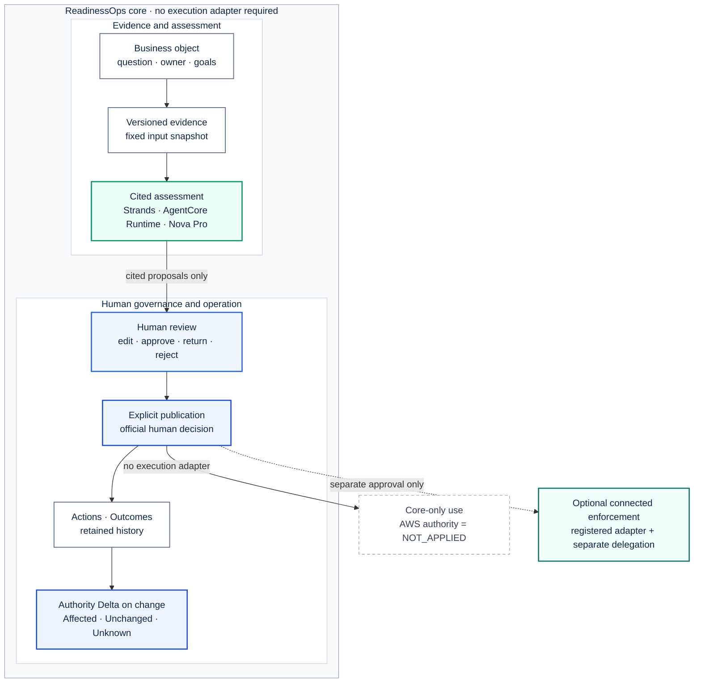
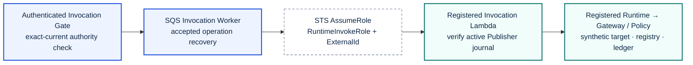
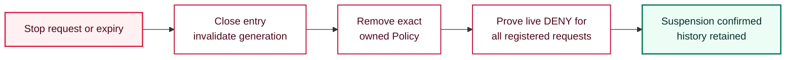

# ReadinessOps architecture

ReadinessOps does not prescribe a two-account topology. The product core remains
usable without an execution adapter: evidence is versioned, the agent proposes,
a human decides and explicitly publishes, Actions and Outcomes are recorded, and
Authority Delta identifies which official decisions are affected by change.

Connected enforcement targets the AWS account registered by an adapter and starts
only after a separate human delegation. The live RO-07 acceptance used distinct
ReadinessOps and target accounts as a least-privilege deployment choice. That is
the topology proven by this repository, not a prerequisite of the product core or
a mandate for every future connector.

The supplied VendorPayment foundation and connector operators require a distinct
target account. A same-account enforcement deployment is not supported or
verified by this release; the core workflow needs neither operator.

## Product boundary

Authority Delta belongs to the product core because change-impact review remains
useful when no execution adapter exists. Publication is an official business
decision in both branches. It never grants AWS runtime authority by itself.

## Optional connected-enforcement roles

The verified connection separates deployment verification, Policy lifecycle and
normal execution. A normal invocation does not pass through the Policy Publisher.

| Purpose | ReadinessOps origin | Connector trust boundary | Qualified connector target |
| --- | --- | --- | --- |
| Deployment verification | CodeBuild deployer | `DiscoveryRole` | Read-only Runtime, Gateway, Policy Engine, target, functions and registry readback |
| Policy application or revocation | Application/Revocation Worker | `PublishInvokeRole` | Limited Publisher Lambda |
| Normal controlled invocation | Invocation Worker | `RuntimeInvokeRole` | Invocation Lambda |

### Policy application and revocation

```mermaid
flowchart LR
    receipt["Official publication<br/>+ separate delegation receipt"]
    worker["Application / Revocation Worker<br/>SQS · retry · reconciliation"]
    boundary["STS AssumeRole<br/>PublishInvokeRole + ExternalId"]
    publisher["Limited Publisher Lambda<br/>exact Policy ownership only"]
    proof["AgentCore Policy lifecycle<br/>deny-first Canary · journal · proof"]

    receipt --> worker --> boundary --> publisher --> proof

    classDef accountA fill:#EEF4FF,stroke:#1D4ED8,color:#0F2747,stroke-width:2px
    classDef trust fill:#FFFFFF,stroke:#64748B,color:#0F2747,stroke-dasharray:5 4
    classDef accountB fill:#F0FDFA,stroke:#0F766E,color:#0F2747,stroke-width:2px

    class receipt,worker accountA
    class boundary trust
    class publisher,proof accountB
```

The Publisher creates, reads or removes only the exact Policy derived from the
immutable candidate. Complete canary and readback evidence must return before
account A installs an AppliedBinding or confirms suspension.

### Normal controlled invocation

The browser can select only a registered request identity. The server fixes the
connection, roles, Runtime, principal, tools, request payload, Policy hash and
expiry. `VendorPayment V2` is a synthetic adapter and performs no real payment.

## Stop and expiry completion rule

This rule applies only when connected authority is active.

Suspension is complete only when the entry is closed, the exact owned Policy is
absent, every registered request has a fresh live `DENY`, and the ledger remains
unchanged. An unknown result remains nonterminal and is recovered fail closed.
